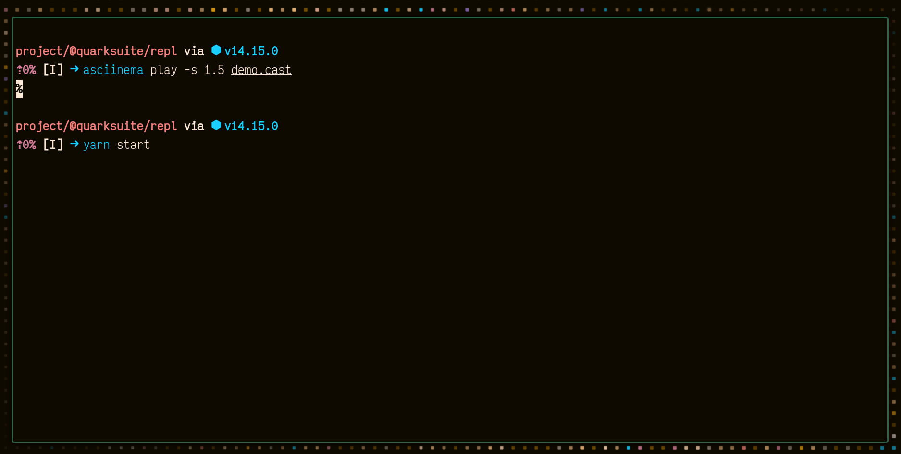

[](https://npmjs.com/package/@quarksuite/core)
[](https://travis-ci.com/github/quarksuite/core)
[](https://coveralls.io/github/quarksuite/core)

[](https://bundlephobia.com/result?p=@quarksuite/core)
[](https://github.com/quarksuite/core/blob/master/LICENSE)

# QuarkSuite


[](https://asciinema.org/a/oJ2Avxd0MbVTLrWFsuKznLnhY?t=5)

<!-- START doctoc generated TOC please keep comment here to allow auto update -->
<!-- DON'T EDIT THIS SECTION, INSTEAD RE-RUN doctoc TO UPDATE -->
Table of Contents

- [Summary](#summary)
- [Features](#features)
  - [Superpowers](#superpowers)
- [Installation](#installation)
  - [As a Module](#as-a-module)
  - [In the Browser](#in-the-browser)
- [Minimal Example](#minimal-example)
- [Usage](#usage)
- [API](#api)
- [Contributing](#contributing)
- [Concept](#concept)
- [Project Objectives](#project-objectives)
  - [Design as a Module](#design-as-a-module)
  - [Works the Way You Work](#works-the-way-you-work)
  - [Zero Friction](#zero-friction)
  - [Simplicity](#simplicity)
  - [Interop](#interop)
- [Use QuarkSuite](#use-quarksuite)
- [Don't Use QuarkSuite](#dont-use-quarksuite)
- [What's In a Name?](#whats-in-a-name)
  - [Quark + Suite](#quark--suite)
- [Inspired By](#inspired-by)

<!-- END doctoc generated TOC please keep comment here to allow auto update -->

## Summary

QuarkSuite is a utility kit for creating, composing, and building [design tokens](https://css-tricks.com/what-are-design-tokens/). Driven by data 
and web technologies.

## Features

+ [adjust colors](https://github.com/quarksuite/core/blob/master/API.md#color-functions), [generate schemes](https://github.com/quarksuite/core/blob/master/API.md#scheme-functions), and [build full palettes](https://github.com/quarksuite/core/blob/master/API.md#variant-functions) with tints, tones, and/or shades
+ [create and modifiy modular scales](https://github.com/quarksuite/core/blob/master/API.md#scale-functions) for your content, layout, and composition
+ [use handy system font stacks and better web defaults](https://github.com/quarksuite/core/blob/master/API.md#prototyping-functions) in your prototypes
+ [build your tokens](https://github.com/quarksuite/core/blob/master/API.md#build-formats) **(added in v5)**
	+ as css custom properties
	+ preprocessor variables (Sass, Less, Stylus supported)
	+ raw JSON data 
	+ Style Dictionary properties for complex builds or unsupported formats
	+ Tailind data for theming

### Superpowers

+ `bind` utilities as settings for reuse
+ `pipe` data through your settings
+ `bind` whole pipelines to create data presets

## Installation

### As a Module

> You’ll require at least Node.js LTS (v12+) to use QuarkSuite as a module.

```bash
npm install @quarksuite/core

# OR

yarn add @quarksuite/core
```

Then in any file:

```js
const { hex, tints, shades, systemfonts, ms, units, css } = require('@quarksuite/core');

// OR w/ Snowpack, Webpack, Parcel

import { hex, tints, shades, systemfonts, ms, units, css } from '@quarksuite/core';
```

### In the Browser

```html
<html lang="en">
  <head>
    <meta charset="utf-8">
    <meta name="viewport" content="width=device-width">
    <title>Quarksuite Example</title>
  </head>
  <body>
    <script type="module">
      import { hex, tints, shades, systemfonts, ms, units, css } from "https://unpkg.com/@quarksuite/core"
      
      // Your baseline
    </script>
  </body>
</html>
```

## Minimal Example

```js
const {
  hex,
  tints,
  shades,
  systemfonts,
  ms,
  units,
  css,
} = require("@quarksuite/core");
const { outputFileSync } = require("fs-extra");

// Palette
const main = hex("gainsboro");
const tint = tints(4, 100, main);
const shade = shades(4, 100, main);

// Fonts
const [sans, mono] = systemfonts("sans-serif", "monospace");

// Size
const init = ms(8, 1.618, 1);
const [base, ...scale] = units(4, "rem", init);

outputFileSync(
  `${__dirname}/tokens/index.css`,
  css({
    color: { main: { base: main, tint, shade } },
    font: { sans, mono },
    content: { size: { base, x: scale } },
  })
);
```
```css
/* tokens/index.css */

:root {
  --color-main: #dcdcdc;
  --color-main-tint-0: #e5e5e5;
  --color-main-tint-1: #eeeeee;
  --color-main-tint-2: #f7f7f7;
  --color-main-tint-3: #ffffff;
  --color-main-shade-0: #bfbfbf;
  --color-main-shade-1: #9c9c9c;
  --color-main-shade-2: #6e6e6e;
  --color-main-shade-3: #000000;
  --font-sans: -apple-system, BlinkMacSystemFont, avenir next, avenir, helvetica neue, helvetica, Ubuntu, roboto, noto, segoe ui, arial, sans-serif;
  --font-mono: Menlo, Consolas, Monaco, Liberation Mono, Lucida Console, monospace;
  --content-size: 1rem;
  --content-size-x-0: 1.618rem;
  --content-size-x-1: 2.618rem;
  --content-size-x-2: 4.236rem;
  --content-size-x-3: 6.854rem;
  --content-size-x-4: 11.09rem;
  --content-size-x-5: 17.94rem;
  --content-size-x-6: 29.03rem;
}
```

## Usage

As of v5, usage has its own documentation. So you'll [want to head over there](https://github.com/quarksuite/core/blob/master/USAGE.md) now.

## API

You can [read the full API documentation](https://github.com/quarksuite/core/blob/master/API.md) for available functions.

## Contributing

You can read about [community and contribution](https://github.com/quarksuite/core/blob/master/CONTRIBUTING.md) and the guidelines for this project.

## Concept

QuarkSuite is built around [design tokens](https://css-tricks.com/what-are-design-tokens/) and the idea that authoring them shouldn't require a 
particular stack or framework.

The library's focus is on reuse and composition of design data and the API favors a data-last
functional approach.

## Project Objectives

These are the constraints guiding current and future development of this kit. Any feature requests that contradict 
them won't be considered.

### Design as a Module

QuarkSuite is structured to take advantage of its functional API to allow creating and composing common sets of design data you can use across projects.

The main advantage of this approach for design token authoring is that you can focus on what's *different* across your projects rather than bothering with the same plumbing and electricity you set up for **every. single. job**.

### Works the Way You Work

This project holds no opinions or comments about your web stack. Integrate your tokens at any stage that naturally works for your process.

### Zero Friction

This project has no dependencies and the included build functions detach  from it at your discretion.

### Simplicity

Each function has a particular job. Functionality that *breaks* the flow becomes a candidate for eventual removal.

### Interop

This project is built to leverage **what already exists** in the design token authoring and UI theming space.

QuarkSuite performs well enough on its own with small projects, but large teams will want to integrate it with meatier 
tools like [Tailwind](https://tailwindcss.com/) or [Theme UI](https://theme-ui.com).

## Use QuarkSuite

+ for small projects that need to be up and running quickly
+ for distributed design data sets you can use between projects
+ for a consistent, flexible design system foundation

## Don't Use QuarkSuite

+ if your design token demands are much more complex than creating and building data to scale
+ if you prefer tools built around batteries-included configuration
+ if you have output demands beyond web technologies

## What's In a Name?

QuarkSuite in its earlier stages went by the name Quarksilver in referring to how quickly you could build your tokens.

### Quark + Suite

In atomic design terminology, the level below atoms could be considered the subatomic parts of a design system.
I noticed quarks and ions was popping up a lot as an analogy for design tokens, so I went with that.

## Inspired By

+ [Ether](https://ether.thescenery.co)
+ [Styled System](https://styled-system.com)
+ [Style Dictionary](https://amzn.github.io/style-dictionary)
