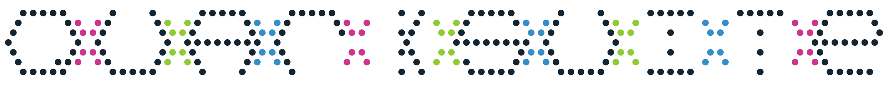

# Quarksuite (Core v3.0.0)



## Summary

Quarksuite is a tool for designers and developers that reimagines core principles as data. It aims to streamline the basic so we can focus more on what our tools can't do.

This library [manipulates color](#color), [generates schemes](#scheme), creates [full palettes](#variant), and defines [modular scales](#scale) for content and proportion. As a bonus, it also provides [operating system font stacks](https://systemfontstack.com/) for quick prototyping.

You can use it as a Node.js module or right in a modern browser.

## Installation

### As a Module

> You’ll require at least Node.js LTS (v6+) to use Quarksuite as a module.

```bash
npm install @quarksuite/core

# OR

yarn add @quarksuite/core
```

Then in any file:

```js
const {color, scheme, variant, typography, scale} = require('@quarksuite/core');

// OR w/ ES Modules, Webpack, Parcel

import {color, scheme, variant, typography, scale} from '@quarksuite/core';
```

### In the Browser

Do the above, then:

```bash
npx snowpack
```

```html
<html lang="en">
  <head>
    <meta charset="utf-8">
    <meta name="viewport" content="width=device-width">
    <title>Quarksuite (v3.0.0) Example</title>
  </head>
  <body>
    <script type="module" src="/index.js"></script>
  </body>
</html>
```

```js
import { color, scheme, variant, typography, scale } from '/web_modules/@quarksuite/core.js';

// Your baseline system
```

OR

```html
<html lang="en">
  <head>
    <meta charset="utf-8">
    <meta name="viewport" content="width=device-width">
    <title>Quarksuite (v2.4.x) Example</title>
  </head>
  <body>
    <script type="module">
      import { color, scheme, variant, typography, scale } from "https://unpkg.com/@quarksuite/core@3.0.0/dist-web/index.bundled.js"
      
      // Your baseline system
    </script>
  </body>
</html>
```

## Usage Examples

### Templating Baseline

```js
const { color, variant, typography, scale } = require('@quarksuite/core');

const main = 'gainsboro';
const toRGB = color.convert('rgb');
const [tints, shades] = [variant.tints(95, 4), variant.shades(95, 3)];

module.exports.palette = {
  base: toRGB(main),
  tints: tints(main),
  shades: shades(main)
};

const [sans, mono] = typography.system('sans', 'monospace');

module.exports.fonts = {
  sans,
  mono
};

const base = 1;
const asRems = scale.output('rem');
const content = scale.create('golden', 6);

module.exports.ms = scale.pipe(content, asRems)(base);
```

### Advanced Baseline

```js
const {
  color,
  scheme,
  variant,
  typography,
  scale
} = require('@quarksuite/core');

// Color -> Color
const swatch = 'dodgerblue';
const desaturate = color.adjust('saturation', s => s - 15);
const mixLime = color.mix('lime', 25);
const mixSkyBlue = color.mix('skyblue', 50);
const colorInput = color.pipe(mixSkyBlue, mixLime, desaturate);

// Color -> Scheme
const midAnalogous = scheme.analogous(30);
const [secondary, main, accent] = midAnalogous(colorInput(swatch));

// Color -> Variant
const [tints, shades] = [variant.tints(95, 3), variant.shades(95, 2)];

const toRGB = color.convert('rgb');

// Color -> Scheme | Variant -> Palette
module.exports.palette = {
  main: {
    base: toRGB(main),
    tints: tints(main),
    shades: shades(main)
  },
  secondary: {
    base: toRGB(secondary),
    shades: shades(secondary)
  },
  accent: {
    base: toRGB(accent),
    shades: shades(accent)
  }
};

const [sans, mono] = typography.system('sans', 'monospace');

module.exports.fonts = {
  sans,
  mono
};

const base = 1;
const asRems = scale.output('rem');
const content = scale.create('golden', 6);

module.exports.ms = scale.pipe(content, asRems)(base);
```

## API

*All functions in v3.0.0 of Quarksuite come curried. You can [read more about currying](https://medium.com/@kbrainwave/currying-in-javascript-ce6da2d324fe) in this article*.

You can [try all examples on RunKit](https://npm.runkit.com/%40quarksuite%2Fcore).

### Color

The color functions accept a `color` of any valid CSS format (hex, rgb, hsl, w3c named colors) and output a color as `rgb()`. Keep in mind that there is no processing of alpha transparency.

#### pipe(...operations)(color)

This function executes operations in a right to left order on a color.

##### Params

+ `operations: Function[]`: The chain of functions to execute on the value

##### Example

```js
const swatch = 'orange';
const desat = color.adjust('saturation', s => s - 10); // valid: standby argument is color
const mixRed = color.mix('red', 45); // valid: standby argument is color

// color -> desaturate color by 10% -> mix 45% with red -> color
color.pipe(mixRed, desat)(swatch)
```

##### Notes

+ It's better to perform color adjustments before mixtures
+ Pay special attention to the result of hue adjustments after mixtures

#### adjust(property)(modifier)(color)
#### adjust(property)(modifier, color)
#### adjust(property, modifier)(color)
#### adjust(property, modifier, color)

This function allows you to adjust the properties of a color with a modifier function.

##### Params

+ `property: string`: the property of the color you want to modify (`hue`, `saturation`, `lightness`)
+ `modifier: (current: number) => number`: modifier function to adjust the property
+ `color: string`: the color to modify

##### Example

```js
// rotate the hue of a color 90 degrees
const swatch = 'dodgerblue';
const hue = color.adjust('hue' h => h + 90);

hueBy90(swatch);

// desaturate by 20%
const desat20 = color.adjust('saturation', s => s - 20);

desat20(swatch);

// lighten by 15%
const lighten15 = color.adjust('lightness', l => l + 15);

lighten15(swatch);
```

##### Notes

+ Hue adjustments have a lower bound of `0` and an upper bound of `720`. This is to allow multiple rotations. A result below or exceeding will yield pure red
+ Saturation adjustments have a lower bound of `0` and an upper bound of `100`. A modifier that returns a number below will yield pure gray. A modifier that exceeds the limit will yield a fully saturated color.
+ Lightness adjustments have the same bounds as saturation. A modifier that returns a number below yields pure black. A modifier that exceeds the limit will yield pure white

#### mix(target)(amount)(color)
#### mix(target)(amount, color)
#### mix(target, amount)(color)
#### mix(target, amount, color)

This function mixes a color with a target by a given amount.

##### Params

+ `target: string`: the target color to mix with
+  `amount: number`: how much to mix with the target (as a percentage)
+  `color: string`: the color to mix

##### Example

```js
const swatch = 'rgb(30%, 35%, 90%)';
const target = 'yellowgreen';

const mixYellowGreen = color.mix(target);

mixYellowGreen(50, swatch);
mixYellowGreen(32, swatch);
mixYellowGreen(85, swatch);
```

##### Notes

+ A great way to use `mix()` is to warm or cool a color. Mixing your main color carefully with your hues can also add harmony to a stark or chaotic color scheme

#### complement(color)

This function fetches the complement of a color.

##### Params

+ `color: string`: the input color

##### Example

```js
const swatch = '#c0ffee';

color.complement(swatch);

// equivalent to
color.adjust('hue', h => h + 180, swatch);
```

#### negate(color)

This function neutralizes a color with its complement.

##### Params

+ `color: string`: the input color

##### Example

```js

const swatch = 'hsl(42, 80%, 40%)';

color.negate(swatch);

// equivalent to
color.mix(color.complement(swatch), 50, swatch);
```

##### Notes

+ The main usage of `negate()` is for creating a neutral palette base

#### convert(to)(color)
#### convert(to, color)

This function converts a color to another CSS format.

##### Params

+ `to: string`: the output format (`hex`, `rgb`, `hsl`, `w3c`)

##### Example

```js
// convert a color to HSL format
const toHSL = color.convert('hsl');

toHSL('red');
```

## Contributing

Please [read the contribution guidelines](CONTRIBUTING.md).

## Development

If you’d like to hack on Quarksuite in a local environment, do the following:

### Clone the Repo

```bash
https://github.com/quarksuite/core.git
```

### Install Dependencies

```bash
npm install 

# OR

yarn
```

### Commands

+ `npm run dev` OR `yarn dev`: run tests on save
+ `npm run build`  OR `yarn build`: build project

## Credit

All of the code for the new internal color conversions was modified from [this CSS Tricks article by Jon Kantner](https://css-tricks.com/converting-color-spaces-in-javascript). Be sure to read it if you want to understand how they work.

